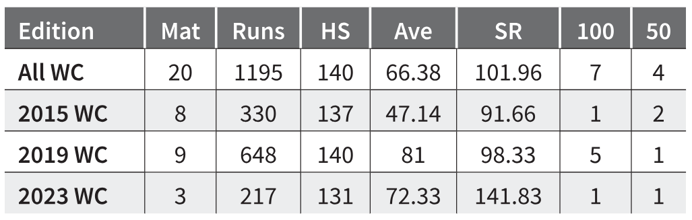

```{r setup, include=FALSE}
knitr::opts_chunk$set(echo = TRUE)
```

## Short Recap: What does gt package do?

It produces nice display tables which are different from the data tables.

A display table is something which you often come across like tables in a web page, a journal article, or in a magazine.


**Note:** The display tables are output only and we are not going to use them as input ever again.

## What more can gt do?

It helps in annotations, table element styling, and text transformations that serve to communicate the subject matter more clearly.

**Example time - let's see how does the gt package works**

**But before that - some basics:**

```{r, message=FALSE}
# install.packages("tidyverse")
# install.packages("gt")
#install.packages("gtExtras")
#install.packages("svglite")
library(gt)
library(tidyverse)
library(gtExtras)
library(svglite)

```

**A sneak peek into the dataset we are going to use - I hope you love "PIZZA"**

```{r, echo=TRUE}
data("pizzaplace")
```

"pizzaplace" is an in-built dataset under the gt package. 

It has information about 32 different types of pizza in 4 different categories: classic, chicken, supreme, and veggie. 

**Let's take a look at our dataset:**
```{r, echo=TRUE}
names(pizzaplace)
head(pizzaplace)
```
Before using the gt package we need to have a table. Let's create a table from our dataset using the dplyr functions.

The table we are creating is this: **Total Sales by Pizza Size (2015)**

```{r, echo=TRUE}
# Group the data by pizza size and calculate total sales for each size
total_sales_by_size <- pizzaplace %>%
  group_by(size) %>%
  summarise(total_sales = sum(price))

# Calculate the overall total sales
overall_total_sales <- sum(total_sales_by_size$total_sales)

# Add a last row for overall total sales
total_sales_by_size <- total_sales_by_size %>%
  add_row(size = "Overall Total", total_sales = overall_total_sales)

# Print the result
total_sales_by_size
```

Okay, so now we have a table.
And here is the first use of gt on the new table - making a display table:
```{r, echo=TRUE}
gt_table1 <- gt(total_sales_by_size)
gt_table1
```
**Note:** The main entry point into the gt API is the gt() function. If we pass total_sales_by_size to the function gt(), we’ll get a gt Table as output.

That doesn't look too bad? It's really basic but hey we didn't ask for much:)

Now we will go ahead and learn about adding parts of a gt Table - if you remember the shiny table from the Presentation:). A brief introduction on them:

* the **Table Header** (optional; with a title and possibly a subtitle) 
* the **Stub and the Stub Head** (optional; contains row labels, optionally within row groups having row group labels and possibly summary labels when a summary is present)
* the **Column Labels** (contains column labels, optionally under spanner column labels)
* the **Table Body** (contains columns and rows of cells)
* the **Table Footer** (optional; possibly with footnotes and source notes)

The way that we add parts like the Table Header and footnotes in the Table Footer is to use the **tab_*()** family of functions. 
A **Table Header** is easy to add so let’s see how the previous table looks with a title:
```{r, echo=TRUE}
# Adding title to our display table
gt_table1 <- gt_table1 %>%
  tab_header(
    title = "Total Sales by Pizza Size (2015)"
  )
gt_table1
```

## Execise 1:The Top 5 Best Selling Pizzas
We want to get the best selling pizzas from this list. Also include the size and price and calculate the total revenue for each pizza.

```{r, echo = TRUE}
top_5_pizzas <- pizzaplace %>% 
  group_by(name, size, price) %>% 
  count(name) %>% 
  arrange(desc(n)) %>% 
  head(5) %>% 
  mutate(rev = price * n) %>% 
  ungroup()

top_5_pizzas
```
So the top selling pizza combination is the small big_meat pizza! 

**Exercise 1:** Lets change the table into a gt object and:

* give it a title and subtitle and make the title bold (hint: use the md() function for that)
* insert spanner label to signify that the price and revenue figures correspond to the year 2015
* change the column names into presentation ready names
* round the revenue numbers to the nearest dollar, eliminating any decimal points

```{r, echo = TRUE}

# Insert your answer here. Use https://gt.rstudio.com/reference/index.html as reference for the needed functions

```
## Exercise 2: Bringing Color into gt-Tables

Okay so now we have a neat table with a Title followed by Subtitle. This looks neat and clean than the first one we created. Yay!

Now, what can we do more to this: maybe we can group some rows together, we can add a highlight color to one of the cells, and maybe we can give the borders some color.
To group rows together, we can use the tab_row_group() function. The syntax for this function is:

tab_row_group(data, label, rows, id = label, others_label = NULL, group = NULL)

With the tab_style() function we can target specific cells and apply styles to them. This is best done in conjunction with the helper functions cell_text(), cell_fill(), and cell_borders().
Here are some of the styles we can apply:

* the background color of the cell (cell_fill(): color)
* the cell's text color, font, and size (cell_text(): color, font, size)
* the text style (cell_text(): style), enabling the use of italics or oblique text.
* the text weight (cell_text(): weight), allowing the use of thin to bold text (the degree of choice is greater with variable fonts)
* the alignment and indentation of text (cell_text(): align and indent)
* the cell borders (cell_borders())

**Exercise 2:** 

* Let's start with the backgroud color of the cells and the text. Change the background color of the title and subtitle from whitespace to Blue.
* Now, try and change the background color of the column labels to light grey and the font to bold.
* Using tab_style, try and change the subtitle to italics

```{r}

# Insert your answer here. Use the functions mentioned above.

```
**Solution**
```{r}
top_5_table <- top_5_table %>%
  tab_options(heading.background.color = 'blue') %>% 
  tab_options(column_labels.font.weight = 'bold',
    column_labels.background.color = 'lightgrey') %>% 
  tab_style(
    style = cell_text(style = 'italic'),
    locations = cells_title(groups = 'subtitle'))
top_5_table
```
In the current table we have three Pizza Size - S, L, and M. How will you group the table so that you have three **row groups**?
```{r}

# Insert your answer here. Use the functions mentioned above.

```
## Exercise 3: Using gtExtras

In the next exercise we will be using **gtExtras** to go above an beyond.
* Create a bar plot in every row that indicates the revenue from each pizza
* Use the New York Times theme
* Add a picture next to the title representing your favorite pizza. Use a picture URL from the web 

```{r}

# Insert your answer here. Use https://jthomasmock.github.io/gtExtras/reference/index.html as reference for the needed functions

```
# Thank You for Your Attention

Further exercises for your own practice:
Do you wanna work your way through a new dataset from the basics, then this script is for you. Just follow along and enjoy the process. Always remember the steps: first from the main dataset you should have a table ready for the outside world and then you use the gt package for formatting your display table.
```{r}
# install.packages("tidyverse")
# install.packages("gt")
# install.packages("gtExtras")
# library(tidyverse)
# library(gt)
# library(gtExtras)


# Loading and getting a preview of the dataset
data("presidential")
head(presidential)
names(presidential)

# Let's make a new table from this dataset. I want a table with the President and their party affiliation
name_party <- presidential %>%
  distinct(name, party)
name_party
```
Now the first step: Change the table in gt object.
```{r}

# Insert your solution here.

```
**Solution:**
```{r}
table1 <- gt(name_party)
table1
```
Add title and subtitle to our display table:
```{r}

# Insert your solution here.

```
**Solution:**
```{r}
table1 <- table1 %>%
  tab_header(
    title = "American President and the Party",
    subtitle = "American Presidents and their party affiliation"
  )
table1
```
Let's make the title and subtitle standout - use of bold and italics:
Add title and subtitle to our display table:
```{r}

# Insert your solution here.

```
**Solution:**
```{r}
table1 <- table1 %>%
  tab_header(
    title = md("**American President and the Party**"),
    subtitle = md("*American Presidents and their party affiliation*")
  )
table1
```
Don't forget to give the credits - rule no. 1 of good research practice (hint: use tab_source_note())
```{r}

# Insert your solution here.

```
**Solution:**
```{r}
table1 <- table1 %>%
  tab_source_note(
    source_note = "Source: The 'presidential' package in ggplot2"
  )
table1
```
What to do if you want to share a information with your audience in the table: 
Add a footnote indicating that Kennedy only served two terms:
```{r}

# Insert your solution here.

```
**Solution:**
```{r}
ttable1 <- table1 %>%
  tab_footnote(
    footnote = "He was president for only 2 years",
    locations = cells_body(columns = name, rows = 2)
  )
table1
```
Now we want two groups in the table - a group of democratic presidents and a group of republican presidents. 
Split up the table into two row groups:
```{r}

# Insert your solution here.

```
**Solution**
```{r}
table1 <- table1 %>%
  tab_row_group(
    id = "Republican",   # Unique ID
    label = "Republican Party",
    rows = c(1, 4, 5, 7, 8, 11)
  ) %>%
  tab_row_group(
    id = "Democratic",   # Unique ID
    label = "Democratic Party",
    rows = c(2, 3, 6, 9, 10)
  )
table1
```
The table is ready and now we want to try out some functions from the **gtExtras** package.

Use the package to edit the table to look like the tables in a NYT articles:
```{r}
gt_theme_nytimes(table1)
```

I am a dark mode fan and I want my table in the dark mode:
```{r}
gt_theme_dark(table1)
```
There are many more things you can do with the gt and gtExtras. Don't forget you just have to put a question mark to get more information about them.
?gt
?gtExtras

Or you can get more info on these links: https://gt.rstudio.com/index.html and https://jthomasmock.github.io/gtExtras/index.html
